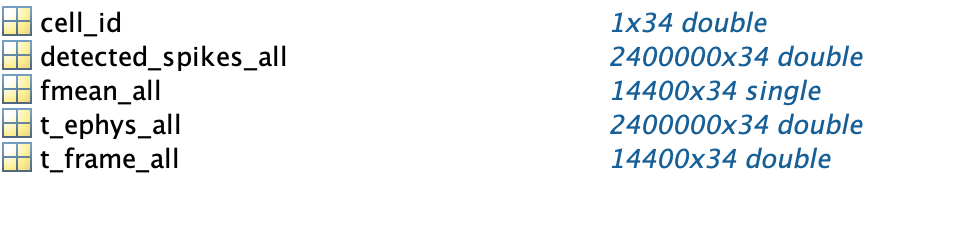
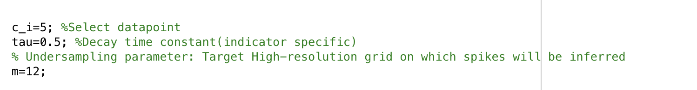
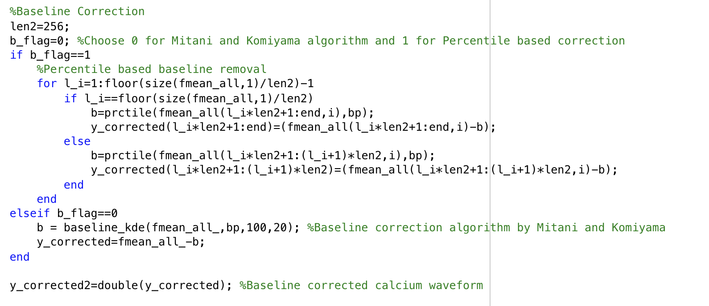
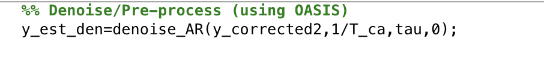
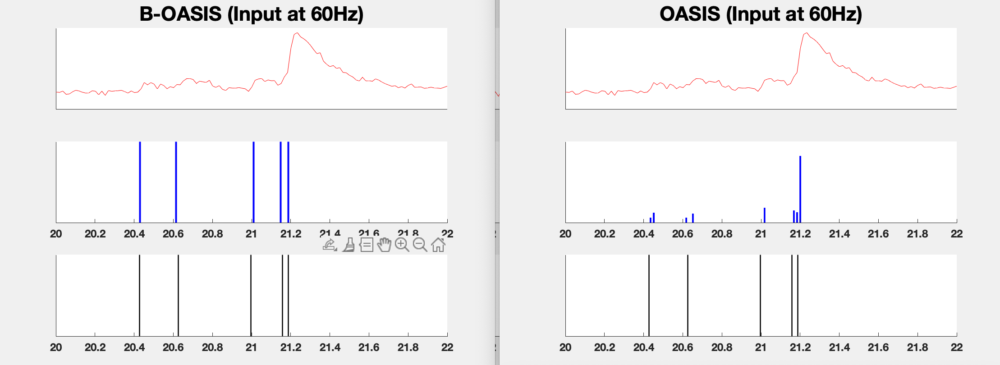
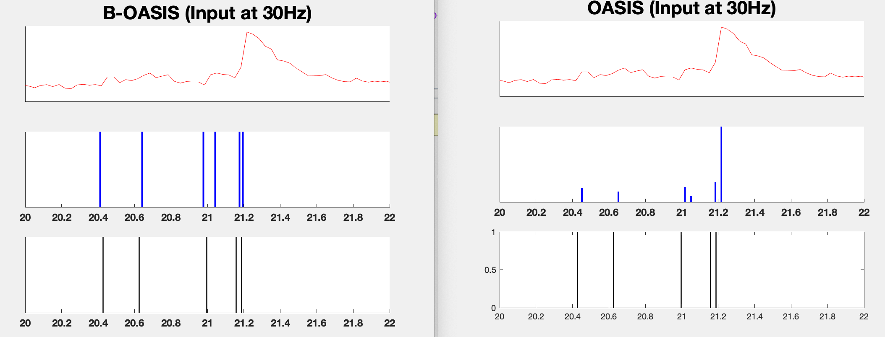
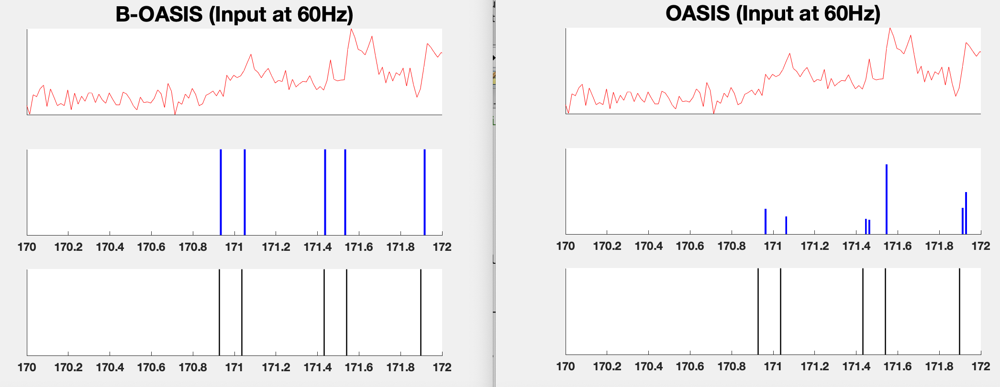
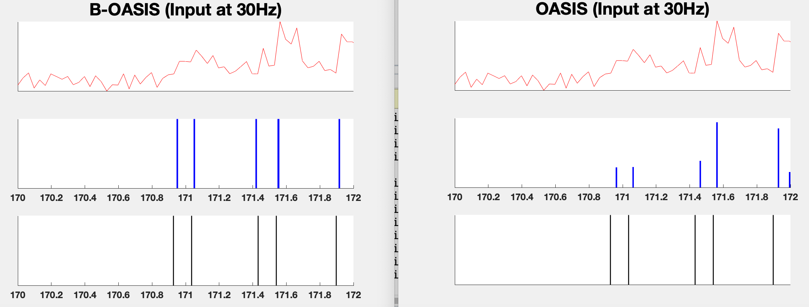

# Super-resolution with Binary Priors: Theory and Algorithms

A MATLAB tool for performing super-resolution spike inference by leveraging binary priors. 

The algorithmic details are described in details in the **[paper](https://ieeexplore.ieee.org/document/10078298)**.

This study is motivated by the problem of neural spike deconvolution arising in calcium imaging. 

## Requirements

This code was implemented using MATLAB 2021b but it should run with any subsequent version as well. It has been tested on systems with 16GB RAM (or higher).

The comparison is performed with the popularly used box-relaxation for binary constraints and this implementation is done using CVX. It can be downloaded from [CVX](http://cvxr.com/cvx/download/) and the installation instructions can be found [here](http://cvxr.com/cvx/doc/install.html).

## Contents

The repository contains the following key MATLAB functions with explanation. A brief summary can be found is provide below:

1. `synth_demo.m`: Spike deconvolution illustration performance on noisy synthetic data. The script compares the proposed approach with the popularly used box-relaxation which relaxes the binary constraint. 
2. `real_demo.m`: Demo script for running the proposed deconvolution pipeline on real calcium imaging data with GCaMP6f indicator. 
3. `comparison_with_FIR.m`: Script to illustrate the role of memory for binary super-resolution
4. `Vary_m_experiment.m`: This script demonstrates how the undersampling factor (`m`) affects ability to perform binary super-resolution
5. `Vary_noise_level.m`: This script analyzes the noisy spike decoding and spike count estimation as a function of noise level.
5. `binary_prep.m` : Function for pre-computing the search set based on model parameters `alpha` and `m` that is required for spike deconvolution.
7. `SpikeDecodeAR.m` :  Function for the spike decoding algorithm for measurements generated by convolution with a AR(1) filter followed by uniform downsampling.
8. `decode_spike_fir.m`: Function for the spike decoding algorithm (based on $\beta$-expansion) for measurements generated by convolution with an FIR filter followed by uniform downsampling..

## Getting Started

1. Setup CVX on MATLAB 
2. Download all the codes in a single directory
3. Download the external tools folder from [google drive](https://drive.google.com/drive/folders/1IDxBp3bvUVyevESLxuVV9Fa1jCok-vTS?usp=sharing) and extract its contents into the Functions directory. 
4. Download the dataset from [google drive](https://drive.google.com/drive/folders/1IDxBp3bvUVyevESLxuVV9Fa1jCok-vTS?usp=sharing)
5.  Run the desired script to generate the results. 

# Generating Results

## Comparison with FIR Filter

Run the script `comparison_with_FIR.m`

The model parameters for generating the synthetic data can be modified at the beginning of the script. The key model parameters are as follows:

* `N`: Length of the binary signal
* `amp`: Amplitude of the binary spikes
* `p`: Spikes are generated independently from a Bernoulli distribution with parameter p
* `L`: Filter length (different values can be selected in the vector l_vec)
* `alpha`: FIR filter is parameterized to be $h_i=\alpha^{i-1}, i=1,2,\cdots,L$, The performance is compared with an AR(1) filter with the same parameter. 
* `mmax`: Maximum Undersampling factor ($<14$ is recommended for a seamless experience)

## Comparison with Relaxation Techniques

Run the script `synth_demo.m`

The model parameters for generating the synthetic data can be modified at the beginning of the script. The key model parameters are as follows:

* `N`: Length of the binary signal
* `amp`: Amplitude of the binary spikes
* `p`: Spikes are generated independently from a Bernoulli distribution with parameter p
* `L`: Filter length (different values can be selected in the vector `l_vec`)
* `alpha`: AR(1) filter with parameter $\alpha$. 
* `m`: Undersampling factor ($<14$)
* `noise`: standard deviation of Gaussian noise added to low-rate measurements 

The two different relaxation techniques used for comparison are:

1. $L_1$ Minimization with non-negativity constraint (Implemented in the function `l1_recovery.m`)
2.  $L_1$ Minimization with box constraint (Implemented in the function `l1_recovery_box.m`)

The script generates plots for deconvolved spike estimates obtained by different techniques and stores them in the folder 'Waveform Plots/'

## Effect of Downsampling Factor

Run the script `Vary_m_experiment.m`

The model parameters for generating the synthetic data can be modified at the beginning of the script and they are kept same as before. The script varies the downsampling factor between 3 to `mmax`. 

## Effect of Noise Level: Spike Estimation vs. Count Estimation

Run the script `Vary_noise_level.m`

The script varies the noise level for two different values of `alpha`. The performance is compared using two different performance metric (i) Individual spike reconstruction (measured using F-score) (ii) Spike count estimation (measured using $l_1$ distance)

The model parameters for generating the synthetic data can be modified at the beginning of the script and same as before. 

## Real Data Experiments

Run the script `real_demo.m` for demonstrating performance comparison between proposed algorithm and OASIS on the publicly available dataset with the GCaMP6f calcium indicator (included in the file `GCaMP6f_chen.mat` which can be downloaded from [link](https://drive.google.com/drive/folders/1IDxBp3bvUVyevESLxuVV9Fa1jCok-vTS?usp=sharing)). 

**Step-by-step walkthrough of the script**

1. **Loading Data and Parameter Setup**: 

The dataset consists of Fluorescence signal from 34 different sessions and the following variables will be loaded form the file:

* `fmean_all`: Contains the raw fluorescence signal sampled at ~60Hz (low-rate).
* `t_frame_all`: Contains the time instances for each of the acquired calcium signal.
* `detected_spike_all`: Ground truth spiking activity acquired using electrophysiological recording sampled at 10KHz (high rate).
* `t_ephys_all`: Time instances for the high rate spiking activity.

You can load your own datasets into these aforementioned variables to use the rest of the script without any modifications. 

The following parameters in the main script can be modified to suit the underlying model parameter:

* `c_i`: Selects the session number (between 1 and 34)
* `tau`: Indicator specific decay time constant
* `m`: Target high-resolution grid on which spikes will be inferred (If calcium is sampled at interval $T_{lo}$ then the spikes would be inferred on a grid with separation $T_{lo}/m$)
 * `b_flag`: Baseline correction algorithm (this can be replaced by your own custom algorithm)
 

2. **Pre-Processing Steps** : 

* Baseline Correction: In the current implementation, we have two implementations for baseline correction algorithm (i) based on percentile computation and (ii) kernel density based algorithm developed in [github](https://github.com/amitani/baseline_kde). If you would like to use a custom baseline correction algorithm, you can return the baseline corrected signal into the variable `y_corrected` and use the remaining script as it is. 

* Denoising: We utilize the denoising capabilities of OASIS algorithm which leverages the underlying autoregressive structure of the measurements. This is achieved by the function `denoise_AR` and the denoised waveform `y_est_den` is then fed to the deconvolution pipeline.  

 

3. **Deconvolution Pipeline**: The deconvolution pipeline is implemented in the function `deconv_full` and implements the binary super-resolution algorithm that is described in our [paper](https://ieeexplore.ieee.org/document/10078298). 

The function requires the AR(1) model parameter ($\alpha$) for the calcium signal modeled at a higher sampling rate and it is computed using the decay time constant (`tau`) and the undersampling parameter (`m`). The inputs are as follows:

* Low-rate Calcium Sampled before and after denoising (`y_corrected2` and `y_est_den`)
* `alpha`: AR(1) coefficient for the high-rate calcium dynamics
* `m`: Target high-resolution grid
* `t_frame_all`: Vector containing sampling time instances for the low-rate calcium signal 

The function returns the following estimates:

* `spike_est22`: Vector containing spiking estimates on a finer temporal grid (length of this vector is `m x length(y_est_den)`) 

* `t_est_22`: Contains the timing instances for the high-resolution grid
* `amp_algo`: Binary spiking amplitude estimated by the algorithm

Under the hood, the function consists of the following main sub-routines:

* Binary Amplitude Estimation: For real data, the binary spiking amplitude is unknown and needs to be estimated from the measurements. The procedure is described in Appendix F of the [paper](https://ieeexplore.ieee.org/document/10078298).

* Preparing data structure for deconvolution: `Binary_prep` function takes in the model parameters and synthesizes the set ($\Theta_{\alpha}$ from the paper) on which Nearest Neighbor decoding will be performed for spike estimation. 

* Binary Spike Decoding: The function `SpikeDecodeAR_real` implements the nearest neighbor spike decoding proposed in the paper by taking in the "denoised" calcium waveform and the model parameters. 

* Spike Pruning: The pruning algorithm takes as input the estimated calcium signal on a finer temporal scale and uses the AR(1) model on the high rate to prune any spurious spiking activities. 

4. **Performance Comparison and Evaluation Metric**: We compare the performance with the OASIS algorithm. The estimated spikes are plotted and we also print the following quantitative evaluation metrics (i) Hit rate (ii) F-score and (iii) median timing error. 

If in a custom dataset, ground truth information is not available then this part of the script can be commented out. 

The script should generate plots as shown below and print the error metrics. 

In this illustration, we show how utilizing Binary priors the performance of OASIS algorithm can be improved. We use the OASIS as a pre-processing/denoising step prior to applying our decoding algorithm. However, it is possible to augment other algorithms with this binary prior or use it in a standalone fashion. 

Case 1 (Ground Truth in Black)

The spikes returned by OASIS only detect a single dominant spike when there are two spikes in the ground truth (close to 21.2 s). Furthermore, the estimated location of the spikes are shifted. This shift is a consequence of obtaining the spike estimates only on a low-resolution grid. 

Case 2 (Ground Truth in Black)

On further reducing the sampling rate (from 60 Hz to 30 Hz), the estimate in the spike timing location further deteriorates as the time-scale over which OASIS returns the estimates becomes coarser. 

Case 3 (Ground Truth in Black)

In this scenario, since the spikes are well-separated, OASIS mostly captures the spiking information. However, it suffers from splitting phenomenon, where a single spike apprears as two peaks with a lower height. The inaccuracy in the spike timing persists due to the coarser grid. 

Case 3 (Ground Truth in Black)

Similar to Case 2, it can be observed that the estimate of the temporal location is significantly mismatched.

## Main References

The main reference is the **[paper](https://ieeexplore.ieee.org/document/10078298)**

Please cite the paper as a reference for binary super-resolution:

P. Sarangi, R. Hattori, T. Komiyama and P. Pal, ``Super-Resolution With Binary Priors: Theory and Algorithms", IEEE Transactions on Signal Processing (2023).

If there are any questions, please reach out to psarangi@eng.ucsd.edu.

